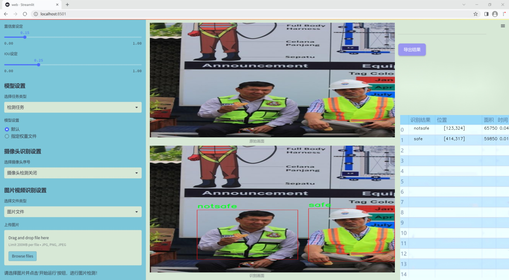
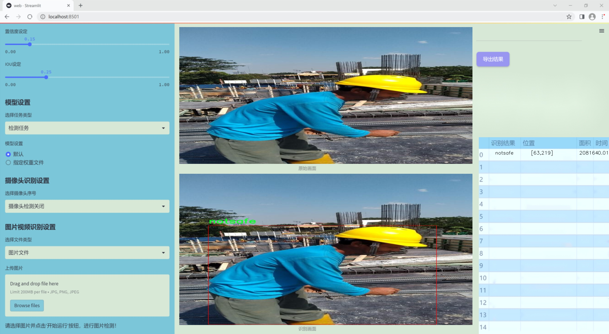
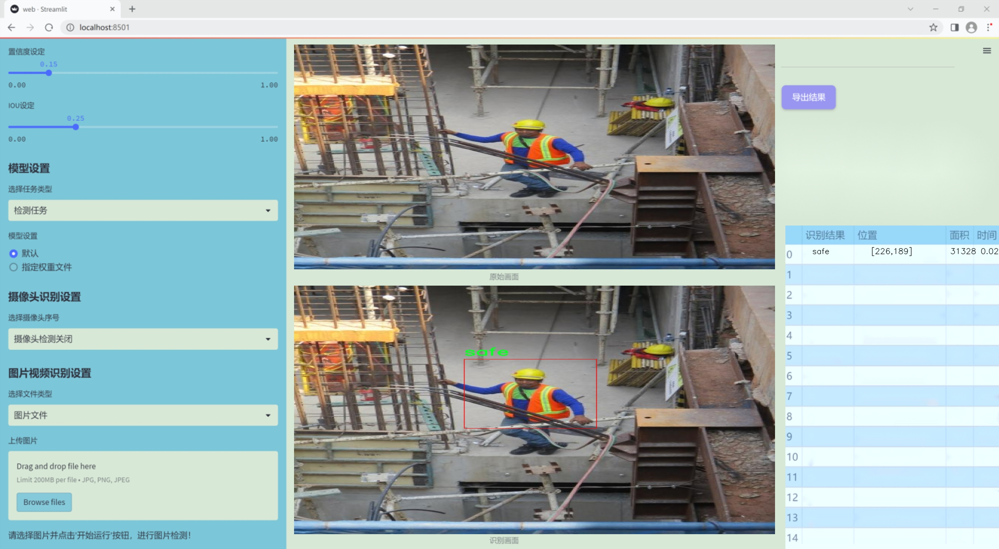
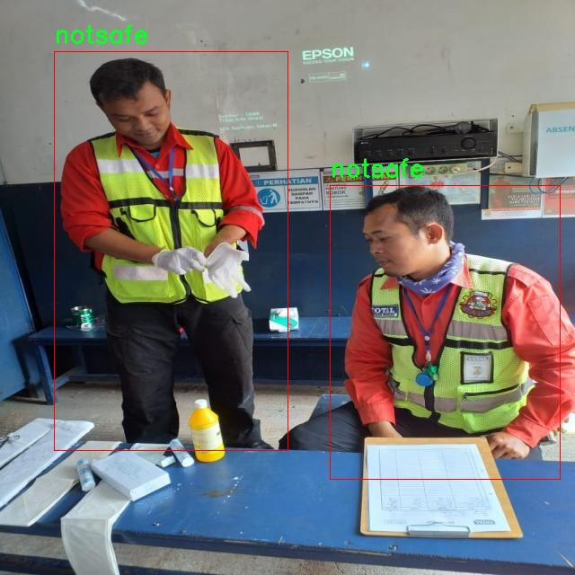
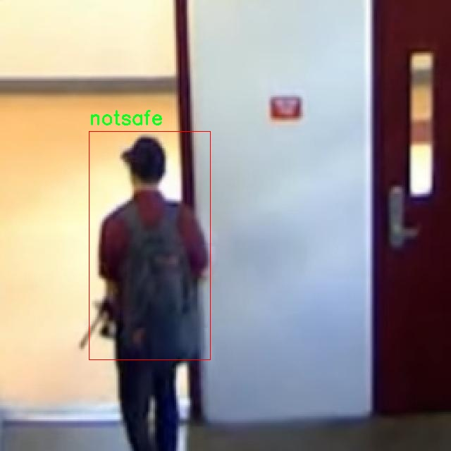
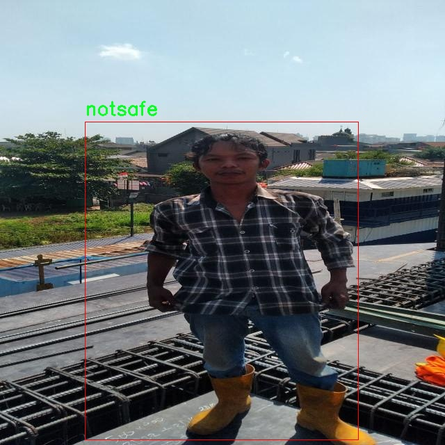
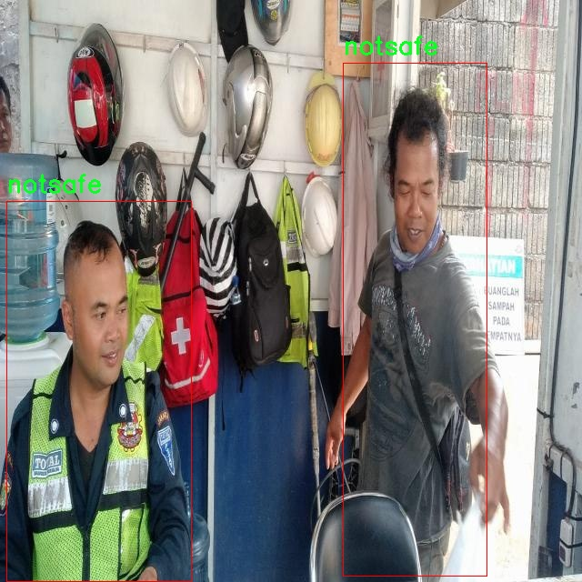
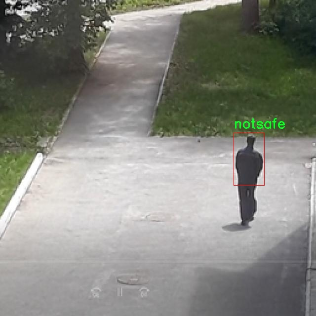

# 改进yolo11-goldyolo等200+全套创新点大全：工厂工人安全防护佩戴状态检测系统源码＆数据集全套

### 1.图片效果展示







##### 项目来源 **[人工智能促进会 2024.10.30](https://kdocs.cn/l/cszuIiCKVNis)**

注意：由于项目一直在更新迭代，上面“1.图片效果展示”和“2.视频效果展示”展示的系统图片或者视频可能为老版本，新版本在老版本的基础上升级如下：（实际效果以升级的新版本为准）

  （1）适配了YOLOV11的“目标检测”模型和“实例分割”模型，通过加载相应的权重（.pt）文件即可自适应加载模型。

  （2）支持“图片识别”、“视频识别”、“摄像头实时识别”三种识别模式。

  （3）支持“图片识别”、“视频识别”、“摄像头实时识别”三种识别结果保存导出，解决手动导出（容易卡顿出现爆内存）存在的问题，识别完自动保存结果并导出到tempDir中。

  （4）支持Web前端系统中的标题、背景图等自定义修改。

  另外本项目提供训练的数据集和训练教程,暂不提供权重文件（best.pt）,需要您按照教程进行训练后实现图片演示和Web前端界面演示的效果。

### 2.视频效果展示

[2.1 视频效果展示](https://www.bilibili.com/video/BV1TFSEY8EvA/)

### 3.背景

研究背景与意义

随着工业化进程的加快，工厂作业环境的安全性日益受到重视。工人安全防护装备的佩戴情况直接关系到其生命安全和健康。因此，建立一个高效、准确的工人安全防护佩戴状态检测系统显得尤为重要。传统的安全检查方法往往依赖人工巡查，效率低下且容易受到主观因素的影响，难以保证实时性和准确性。近年来，计算机视觉技术的迅猛发展为安全检测提供了新的解决方案，尤其是基于深度学习的目标检测模型在图像识别领域展现出了优异的性能。

本研究旨在基于改进的YOLOv11模型，构建一个针对工厂工人安全防护佩戴状态的检测系统。我们将利用包含1200张图像的数据集，该数据集涵盖了三类安全状态（nohelm、notsafe、novest）以及工人安全佩戴状态（safe）。通过对这些图像的分析，系统能够实时识别工人的安全防护状态，并及时发出警报，确保工人在作业过程中的安全。

改进YOLOv11模型的引入，旨在提升检测的准确性和速度，使其能够在复杂的工厂环境中有效运行。该系统不仅可以降低工伤事故的发生率，还能够为工厂管理者提供数据支持，帮助其制定更为科学的安全管理措施。此外，通过对工人佩戴状态的监测，可以增强工人的安全意识，促进安全文化的建设。综上所述，本研究具有重要的理论价值和实际应用意义，将为工厂安全管理提供创新的技术手段。

### 4.数据集信息展示

##### 4.1 本项目数据集详细数据（类别数＆类别名）

nc: 2
names: ['notsafe', 'safe']


该项目为【目标检测】数据集，请在【训练教程和Web端加载模型教程（第三步）】这一步的时候按照【目标检测】部分的教程来训练

##### 4.2 本项目数据集信息介绍

本项目数据集信息介绍

本项目所使用的数据集名为“icare”，旨在为改进YOLOv11的工厂工人安全防护佩戴状态检测系统提供支持。该数据集专注于工人安全防护装备的佩戴状态，包含两大类别：安全佩戴（safe）和不安全佩戴（notsafe）。通过对这两类状态的精确识别与分类，系统能够有效监测工人在工作环境中的安全行为，从而为提升工人安全防护意识和降低事故发生率提供数据支持。

“icare”数据集的构建过程涉及多种工厂环境的实地拍摄，确保涵盖不同工种、不同工作场景及不同光照条件下的工人佩戴状态。这种多样性使得数据集在实际应用中具有更高的适应性和准确性。每一张图像都经过精心标注，确保其对应的类别信息准确无误，为后续的模型训练提供了坚实的基础。

在数据集的使用过程中，YOLOv11模型将通过对“icare”数据集的学习，掌握工人佩戴安全装备的特征，从而实现对工人安全状态的实时监测。该系统不仅可以在工厂内部署，还能够与智能监控系统结合，形成一个全面的安全管理平台。通过对工人佩戴状态的实时分析，企业能够及时发现安全隐患，并采取相应措施，确保工人的安全与健康。

总之，“icare”数据集为本项目提供了重要的支持，助力于构建一个高效、智能的工人安全防护佩戴状态检测系统，推动工厂安全管理的智能化与科学化进程。











### 5.全套项目环境部署视频教程（零基础手把手教学）

[5.1 所需软件PyCharm和Anaconda安装教程（第一步）](https://www.bilibili.com/video/BV1BoC1YCEKi/?spm_id_from=333.999.0.0&vd_source=bc9aec86d164b67a7004b996143742dc)


[5.2 安装Python虚拟环境创建和依赖库安装视频教程（第二步）](https://www.bilibili.com/video/BV1ZoC1YCEBw?spm_id_from=333.788.videopod.sections&vd_source=bc9aec86d164b67a7004b996143742dc)

### 6.改进YOLOv11训练教程和Web_UI前端加载模型教程（零基础手把手教学）

[6.1 改进YOLOv11训练教程和Web_UI前端加载模型教程（第三步）](https://www.bilibili.com/video/BV1BoC1YCEhR?spm_id_from=333.788.videopod.sections&vd_source=bc9aec86d164b67a7004b996143742dc)


按照上面的训练视频教程链接加载项目提供的数据集，运行train.py即可开始训练



     Epoch   gpu_mem       box       obj       cls    labels  img_size
     1/200     20.8G   0.01576   0.01955  0.007536        22      1280: 100%|██████████| 849/849 [14:42<00:00,  1.04s/it]
               Class     Images     Labels          P          R     mAP@.5 mAP@.5:.95: 100%|██████████| 213/213 [01:14<00:00,  2.87it/s]
                 all       3395      17314      0.994      0.957      0.0957      0.0843

     Epoch   gpu_mem       box       obj       cls    labels  img_size
     2/200     20.8G   0.01578   0.01923  0.007006        22      1280: 100%|██████████| 849/849 [14:44<00:00,  1.04s/it]
               Class     Images     Labels          P          R     mAP@.5 mAP@.5:.95: 100%|██████████| 213/213 [01:12<00:00,  2.95it/s]
                 all       3395      17314      0.996      0.956      0.0957      0.0845

     Epoch   gpu_mem       box       obj       cls    labels  img_size
     3/200     20.8G   0.01561    0.0191  0.006895        27      1280: 100%|██████████| 849/849 [10:56<00:00,  1.29it/s]
               Class     Images     Labels          P          R     mAP@.5 mAP@.5:.95: 100%|███████   | 187/213 [00:52<00:00,  4.04it/s]
                 all       3395      17314      0.996      0.957      0.0957      0.0845


###### [项目数据集下载链接](https://kdocs.cn/l/cszuIiCKVNis)

### 7.原始YOLOv11算法讲解


##### YOLO11介绍

Ultralytics YOLO11是一款尖端的、最先进的模型，它在之前YOLO版本成功的基础上进行了构建，并引入了新功能和改进，以进一步提升性能和灵活性。
**YOLO11设计快速、准确且易于使用，使其成为各种物体检测和跟踪、实例分割、图像分类以及姿态估计任务的绝佳选择。**


**结构图如下：**


##### **C3k2**

**C3k2，结构图如下**


**C3k2，继承自类`C2f，其中通过c3k设置False或者Ture来决定选择使用C3k还是`**Bottleneck


**实现代码** **ultralytics/nn/modules/block.py**

##### C2PSA介绍

**借鉴V10 PSA结构，实现了C2PSA和C2fPSA，最终选择了基于C2的C2PSA（可能涨点更好？）**


**实现代码** **ultralytics/nn/modules/block.py**

##### Detect介绍

**分类检测头引入了DWConv（更加轻量级，为后续二次创新提供了改进点），结构图如下（和V8的区别）：**


### 8.200+种全套改进YOLOV11创新点原理讲解

#### 8.1 200+种全套改进YOLOV11创新点原理讲解大全

由于篇幅限制，每个创新点的具体原理讲解就不全部展开，具体见下列网址中的改进模块对应项目的技术原理博客网址【Blog】（创新点均为模块化搭建，原理适配YOLOv5~YOLOv11等各种版本）

[改进模块技术原理博客【Blog】网址链接](https://gitee.com/qunmasj/good)


#### 8.2 精选部分改进YOLOV11创新点原理讲解

###### 这里节选部分改进创新点展开原理讲解(完整的改进原理见上图和[改进模块技术原理博客链接](https://gitee.com/qunmasj/good)【如果此小节的图加载失败可以通过CSDN或者Github搜索该博客的标题访问原始博客，原始博客图片显示正常】
### CBAM空间注意力机制
近年来，随着深度学习研究方向的火热，注意力机制也被广泛地应用在图像识别、语音识别和自然语言处理等领域，注意力机制在深度学习任务中发挥着举足轻重的作用。注意力机制借鉴于人类的视觉系统，例如，人眼在看到一幅画面时，会倾向于关注画面中的重要信息，而忽略其他可见的信息。深度学习中的注意力机制和人类视觉的注意力机制相似，通过扫描全局数据，从大量数据中选择出需要重点关注的、对当前任务更为重要的信息，然后对这部分信息分配更多的注意力资源，从这些信息中获取更多所需要的细节信息，而抑制其他无用的信息。而在深度学习中，则具体表现为给感兴趣的区域更高的权重，经过网络的学习和调整，得到最优的权重分配，形成网络模型的注意力，使网络拥有更强的学习能力，加快网络的收敛速度。
注意力机制通常可分为软注意力机制和硬注意力机制[4-5]。软注意力机制在选择信息时，不是从输入的信息中只选择1个，而会用到所有输入信息，只是各个信息对应的权重分配不同，然后输入网络模型进行计算;硬注意力机制则是从输入的信息中随机选取一个或者选择概率最高的信息，但是这一步骤通常是不可微的，导致硬注意力机制更难训练。因此，软注意力机制应用更为广泛，按照原理可将软注意力机制划分为:通道注意力机制（channel attention)、空间注意力机制(spatial attention）和混合域注意力机制(mixed attention)。
通道注意力机制的本质建立各个特征通道之间的重要程度，对感兴趣的通道进行重点关注，弱化不感兴趣的通道的作用;空间注意力的本质则是建模了整个空间信息的重要程度，然后对空间内感兴趣的区域进行重点关注，弱化其余非感兴趣区域的作用;混合注意力同时运用了通道注意力和空间注意力，两部分先后进行或并行，形成对通道特征和空间特征同时关注的注意力模型。

卷积层注意力模块(Convolutional Block Attention Module，CBAM）是比较常用的混合注意力模块，其先后集中了通道注意力模块和空间注意力模块，网络中加入该模块能有效提高网络性能，减少网络模型的计算量，模块结构如图所示。输入特征图首先经过分支的通道注意力模块，然后和主干的原特征图融合，得到具有通道注意力的特征图，接着经过分支的空间注意力模块，在和主干的特征图融合后，得到同时具有通道特征注意力和空间特征注意力的特征图。CBAM模块不改变输入特征图的大小，因此该模块是一个“即插即用”的模块，可以插入网络的任何位置。

通道注意力模块的结构示意图如图所示，通道注意力模块分支并行地对输入的特征图进行最大池化操作和平均池化操作，然后利用多层感知机对结果进行变换，得到应用于两个通道的变换结果，最后经过sigmoid激活函数将变换结果融合，得到具有通道注意力的通道特征图。

空间注意力模块示意图如图所示，将通道注意力模块输出的特征图作为该模块的输入特征图，首先对输入特征图进行基于通道的最大池化操作和平均池化操作，将两部分得到的结果拼接起来，然后通过卷积得到降为Ⅰ通道的特征图，最后通过sigmoid激活函数生成具有空间注意力的特征图。


### 9.系统功能展示

图9.1.系统支持检测结果表格显示

  图9.2.系统支持置信度和IOU阈值手动调节

  图9.3.系统支持自定义加载权重文件best.pt(需要你通过步骤5中训练获得)

  图9.4.系统支持摄像头实时识别

  图9.5.系统支持图片识别

  图9.6.系统支持视频识别

  图9.7.系统支持识别结果文件自动保存

  图9.8.系统支持Excel导出检测结果数据


### 10. YOLOv11核心改进源码讲解

#### 10.1 metaformer.py

以下是代码中最核心的部分，并附上详细的中文注释：

```python
import torch
import torch.nn as nn
import torch.nn.functional as F

class MF_Attention(nn.Module):
    """
    自注意力机制的实现，参考Transformer模型。
    """
    def __init__(self, dim, head_dim=32, num_heads=None, qkv_bias=False,
                 attn_drop=0., proj_drop=0., proj_bias=False):
        super().__init__()

        self.head_dim = head_dim  # 每个头的维度
        self.scale = head_dim ** -0.5  # 缩放因子

        # 计算头的数量
        self.num_heads = num_heads if num_heads else dim // head_dim
        if self.num_heads == 0:
            self.num_heads = 1
        
        self.attention_dim = self.num_heads * self.head_dim  # 总的注意力维度

        # 定义Q、K、V的线性变换
        self.qkv = nn.Linear(dim, self.attention_dim * 3, bias=qkv_bias)
        self.attn_drop = nn.Dropout(attn_drop)  # 注意力的dropout
        self.proj = nn.Linear(self.attention_dim, dim, bias=proj_bias)  # 输出的线性变换
        self.proj_drop = nn.Dropout(proj_drop)  # 输出的dropout

    def forward(self, x):
        B, H, W, C = x.shape  # B: batch size, H: height, W: width, C: channel
        N = H * W  # 总的token数量
        # 计算Q、K、V
        qkv = self.qkv(x).reshape(B, N, 3, self.num_heads, self.head_dim).permute(2, 0, 3, 1, 4)
        q, k, v = qkv.unbind(0)  # 分离Q、K、V

        # 计算注意力权重
        attn = (q @ k.transpose(-2, -1)) * self.scale  # 点积注意力
        attn = attn.softmax(dim=-1)  # softmax归一化
        attn = self.attn_drop(attn)  # 应用dropout

        # 计算输出
        x = (attn @ v).transpose(1, 2).reshape(B, H, W, self.attention_dim)
        x = self.proj(x)  # 线性变换
        x = self.proj_drop(x)  # 应用dropout
        return x


class Mlp(nn.Module):
    """
    多层感知机（MLP）的实现，常用于MetaFormer模型。
    """
    def __init__(self, dim, mlp_ratio=4, out_features=None, act_layer=nn.ReLU, drop=0., bias=False):
        super().__init__()
        in_features = dim
        out_features = out_features or in_features  # 输出特征数
        hidden_features = int(mlp_ratio * in_features)  # 隐藏层特征数

        self.fc1 = nn.Linear(in_features, hidden_features, bias=bias)  # 第一层线性变换
        self.act = act_layer()  # 激活函数
        self.drop1 = nn.Dropout(drop)  # dropout
        self.fc2 = nn.Linear(hidden_features, out_features, bias=bias)  # 第二层线性变换
        self.drop2 = nn.Dropout(drop)  # dropout

    def forward(self, x):
        x = self.fc1(x)  # 线性变换
        x = self.act(x)  # 激活
        x = self.drop1(x)  # 应用dropout
        x = self.fc2(x)  # 线性变换
        x = self.drop2(x)  # 应用dropout
        return x


class MetaFormerBlock(nn.Module):
    """
    MetaFormer块的实现。
    """
    def __init__(self, dim,
                 token_mixer=nn.Identity, mlp=Mlp,
                 norm_layer=nn.LayerNorm,
                 drop=0., drop_path=0.,
                 layer_scale_init_value=None, res_scale_init_value=None):

        super().__init__()

        self.norm1 = norm_layer(dim)  # 第一层归一化
        self.token_mixer = token_mixer(dim=dim, drop=drop)  # token混合层
        self.drop_path1 = nn.Identity() if drop_path <= 0. else nn.Dropout(drop_path)  # 路径dropout
        self.layer_scale1 = nn.Identity() if layer_scale_init_value is None else nn.Parameter(torch.ones(dim) * layer_scale_init_value)  # 层缩放
        self.res_scale1 = nn.Identity() if res_scale_init_value is None else nn.Parameter(torch.ones(dim) * res_scale_init_value)  # 残差缩放

        self.norm2 = norm_layer(dim)  # 第二层归一化
        self.mlp = mlp(dim=dim, drop=drop)  # MLP层
        self.drop_path2 = nn.Identity() if drop_path <= 0. else nn.Dropout(drop_path)  # 路径dropout
        self.layer_scale2 = nn.Identity() if layer_scale_init_value is None else nn.Parameter(torch.ones(dim) * layer_scale_init_value)  # 层缩放
        self.res_scale2 = nn.Identity() if res_scale_init_value is None else nn.Parameter(torch.ones(dim) * res_scale_init_value)  # 残差缩放

    def forward(self, x):
        x = x.permute(0, 2, 3, 1)  # 转换维度
        x = self.res_scale1(x) + self.layer_scale1(self.drop_path1(self.token_mixer(self.norm1(x))))  # 第一部分
        x = self.res_scale2(x) + self.layer_scale2(self.drop_path2(self.mlp(self.norm2(x))))  # 第二部分
        return x.permute(0, 3, 1, 2)  # 转换回原始维度
```

### 代码核心部分分析：
1. **MF_Attention**: 实现了自注意力机制，包含Q、K、V的计算和注意力权重的应用。
2. **Mlp**: 实现了多层感知机，包含两个线性层和激活函数，常用于特征转换。
3. **MetaFormerBlock**: 实现了MetaFormer的基本模块，包含归一化、token混合、MLP和残差连接，支持路径dropout和层缩放。

这些模块是构建MetaFormer架构的基础，提供了必要的功能以实现高效的特征提取和表示学习。

这个文件 `metaformer.py` 实现了一些与 MetaFormer 相关的深度学习模块，主要用于图像处理和计算机视觉任务。代码中使用了 PyTorch 框架，包含了多个类，每个类实现了特定的功能。

首先，`Scale` 类用于对输入张量进行元素级别的缩放，允许通过训练来调整缩放因子。`SquaredReLU` 和 `StarReLU` 类实现了不同形式的激活函数，前者是平方 ReLU，后者则在 ReLU 的基础上添加了可学习的缩放和偏置。

`MF_Attention` 类实现了自注意力机制，主要用于处理输入的特征图。它通过线性变换生成查询、键和值，然后计算注意力权重并应用于值，最后通过线性变换将结果映射回原始维度。

`RandomMixing` 类则实现了一种随机混合机制，通过一个随机矩阵对输入进行线性变换，以增加模型的多样性。

`LayerNormGeneral` 和 `LayerNormWithoutBias` 类实现了不同形式的层归一化，前者提供了更多的灵活性以适应不同的输入形状和归一化维度，后者则是一个优化版本，去掉了偏置项以提高效率。

`SepConv` 类实现了分离卷积，采用了深度可分离卷积的思想，先通过一个线性层进行通道扩展，再进行深度卷积，最后通过另一个线性层将通道数恢复。

`Pooling` 类实现了一种特定的池化操作，旨在提取特征并减去原始输入，以突出重要信息。

`Mlp` 类实现了多层感知机，包含两个线性层和激活函数，常用于特征的非线性变换。

`ConvolutionalGLU` 类实现了一种卷积门控线性单元（GLU），结合了卷积和门控机制，以提高模型的表达能力。

`MetaFormerBlock` 和 `MetaFormerCGLUBlock` 类实现了 MetaFormer 的基本构建块，前者使用普通的 MLP，后者则使用卷积 GLU。它们都包含了归一化、残差连接和可选的 DropPath 机制，以增强模型的训练稳定性和性能。

整体而言，这个文件定义了一系列模块，旨在构建灵活且高效的 MetaFormer 模型，适用于各种计算机视觉任务。通过组合这些模块，可以实现不同的网络架构，以满足特定的需求。

#### 10.2 cfpt.py

以下是经过简化和注释的核心代码部分，主要保留了 `CrossLayerSpatialAttention` 和 `CrossLayerChannelAttention` 类的实现，以及它们的前向传播逻辑。代码中的注释详细解释了每个部分的功能和作用。

```python
import torch
import torch.nn as nn
import torch.nn.functional as F
from timm.layers import to_2tuple, trunc_normal_

class CrossLayerPosEmbedding3D(nn.Module):
    def __init__(self, num_heads=4, window_size=(5, 3, 1), spatial=True):
        super(CrossLayerPosEmbedding3D, self).__init__()
        self.spatial = spatial  # 是否使用空间位置嵌入
        self.num_heads = num_heads  # 注意力头的数量
        self.layer_num = len(window_size)  # 层数
        # 初始化相对位置偏置表
        self.relative_position_bias_table = nn.Parameter(torch.zeros((2 * window_size[0] - 1) * (2 * window_size[0] - 1), num_heads))
        trunc_normal_(self.relative_position_bias_table, std=.02)  # 使用截断正态分布初始化

    def forward(self):
        # 计算位置嵌入
        pos_embed = self.relative_position_bias_table.view(1, 1, -1, self.num_heads)
        return pos_embed

class CrossLayerSpatialAttention(nn.Module):
    def __init__(self, in_dim, layer_num=3, beta=1, num_heads=4, mlp_ratio=2, reduction=4):
        super(CrossLayerSpatialAttention, self).__init__()
        self.num_heads = num_heads  # 注意力头的数量
        self.hidden_dim = in_dim // reduction  # 隐藏层维度
        self.window_sizes = [(2 ** i + beta) if i != 0 else (2 ** i + beta - 1) for i in range(layer_num)][::-1]  # 窗口大小
        self.token_num_per_layer = [i ** 2 for i in self.window_sizes]  # 每层的token数量
        self.token_num = sum(self.token_num_per_layer)  # 总token数量

        # 初始化卷积位置编码
        self.cpe = nn.ModuleList([ConvPosEnc(dim=in_dim, k=3) for _ in range(layer_num)])
        self.qkv = nn.ModuleList(nn.Conv2d(in_dim, self.hidden_dim * 3, kernel_size=1) for _ in range(layer_num))  # QKV线性变换
        self.softmax = nn.Softmax(dim=-1)  # Softmax层
        self.pos_embed = CrossLayerPosEmbedding3D(num_heads=num_heads, window_size=self.window_sizes, spatial=True)  # 位置嵌入

    def forward(self, x_list):
        q_list, k_list, v_list = [], [], []  # 存储Q、K、V的列表

        for i, x in enumerate(x_list):
            qkv = self.qkv[i](x)  # 计算QKV
            qkv_windows = overlaped_window_partition(qkv, self.window_sizes[i], stride=1, pad=0)  # 窗口分区
            q_windows, k_windows, v_windows = qkv_windows[0], qkv_windows[1], qkv_windows[2]  # 分离Q、K、V
            q_list.append(q_windows)
            k_list.append(k_windows)
            v_list.append(v_windows)

        # 将所有层的Q、K、V堆叠在一起
        q_stack = torch.cat(q_list, dim=-2)
        k_stack = torch.cat(k_list, dim=-2)
        v_stack = torch.cat(v_list, dim=-2)

        attn = F.normalize(q_stack, dim=-1) @ F.normalize(k_stack, dim=-1).transpose(-1, -2)  # 计算注意力
        attn = attn + self.pos_embed()  # 加上位置嵌入
        attn = self.softmax(attn)  # 归一化

        out = attn @ v_stack  # 应用注意力到V
        return out  # 返回输出

class CrossLayerChannelAttention(nn.Module):
    def __init__(self, in_dim, layer_num=3, alpha=1, num_heads=4, mlp_ratio=2, reduction=4):
        super(CrossLayerChannelAttention, self).__init__()
        self.num_heads = num_heads  # 注意力头的数量
        self.hidden_dim = in_dim // reduction  # 隐藏层维度
        self.window_sizes = [(4 ** i + alpha) if i != 0 else (4 ** i + alpha - 1) for i in range(layer_num)][::-1]  # 窗口大小
        self.token_num_per_layer = [i for i in self.window_sizes]  # 每层的token数量

        # 初始化卷积位置编码
        self.cpe = nn.ModuleList([ConvPosEnc(dim=in_dim, k=3) for _ in range(layer_num)])
        self.qkv = nn.ModuleList(nn.Conv2d(in_dim, self.hidden_dim * 3, kernel_size=1) for _ in range(layer_num))  # QKV线性变换
        self.softmax = nn.Softmax(dim=-1)  # Softmax层
        self.pos_embed = CrossLayerPosEmbedding3D(num_heads=num_heads, window_size=self.window_sizes, spatial=False)  # 位置嵌入

    def forward(self, x_list):
        q_list, k_list, v_list = [], [], []  # 存储Q、K、V的列表

        for i, x in enumerate(x_list):
            x = self.cpe[i](x)  # 应用卷积位置编码
            qkv = self.qkv[i](x)  # 计算QKV
            q_windows, k_windows, v_windows = qkv.chunk(3, dim=1)  # 分离Q、K、V
            q_list.append(q_windows)
            k_list.append(k_windows)
            v_list.append(v_windows)

        # 将所有层的Q、K、V堆叠在一起
        q_stack = torch.cat(q_list, dim=-2)
        k_stack = torch.cat(k_list, dim=-2)
        v_stack = torch.cat(v_list, dim=-2)

        attn = F.normalize(q_stack, dim=-1) @ F.normalize(k_stack, dim=-1).transpose(-2, -1)  # 计算注意力
        attn = attn + self.pos_embed()  # 加上位置嵌入
        attn = self.softmax(attn)  # 归一化

        out = attn @ v_stack  # 应用注意力到V
        return out  # 返回输出
```

### 代码解释：
1. **CrossLayerPosEmbedding3D**: 该类用于计算位置嵌入，支持空间和通道的相对位置偏置。
2. **CrossLayerSpatialAttention**: 该类实现了跨层空间注意力机制，主要通过窗口分区和注意力计算来聚合信息。
3. **CrossLayerChannelAttention**: 该类实现了跨层通道注意力机制，类似于空间注意力，但在通道维度上进行操作。
4. **前向传播**: 在 `forward` 方法中，输入的特征图经过 QKV 变换、窗口分区、注意力计算和输出合并，最终返回注意力加权后的特征图。

通过这些注释，代码的结构和功能变得更加清晰，便于理解其实现细节。

这个程序文件 `cfpt.py` 定义了两个主要的类：`CrossLayerChannelAttention` 和 `CrossLayerSpatialAttention`，它们实现了跨层的通道注意力和空间注意力机制。这些类的设计旨在提高深度学习模型在处理图像时的特征提取能力，尤其是在视觉任务中。

首先，文件导入了一些必要的库，包括 PyTorch 和 einops 等。接着，定义了一个 `LayerNormProxy` 类，它是对 PyTorch 的 `LayerNorm` 的封装，主要用于调整输入的维度顺序，以适应后续的归一化操作。

`CrossLayerPosEmbedding3D` 类用于生成三维的跨层位置嵌入。这个类根据给定的窗口大小和头数，计算相对位置偏置，并使用正态分布初始化位置偏置表。它的 `forward` 方法生成位置嵌入，考虑了绝对和相对位置的影响。

`ConvPosEnc` 类实现了卷积位置编码，使用深度可分离卷积来处理输入特征，并可选择性地应用激活函数。

`DWConv` 类实现了深度卷积操作，主要用于在通道维度上进行特征提取。

`Mlp` 类实现了一个简单的多层感知机结构，包含两个线性层和一个激活函数。

接下来，定义了一些用于处理窗口分割和重组的辅助函数，如 `overlaped_window_partition` 和 `overlaped_window_reverse`，这些函数帮助在空间和通道维度上进行特征的分割和重组。

`CrossLayerSpatialAttention` 类实现了跨层空间注意力机制。它的构造函数初始化了一系列参数，包括窗口大小、步幅、卷积层和归一化层。在 `forward` 方法中，输入特征通过卷积和注意力机制进行处理，最终输出经过注意力加权的特征。

`CrossLayerChannelAttention` 类与 `CrossLayerSpatialAttention` 类类似，但它专注于通道维度的注意力机制。它的构造函数和 `forward` 方法与空间注意力机制的实现类似，但在处理输入特征时采用了不同的策略，特别是在通道分割和重组方面。

整体来看，这个文件实现了复杂的注意力机制，旨在通过跨层的信息交互来增强特征表示能力。这些机制可以在视觉任务中提高模型的性能，尤其是在需要捕捉长距离依赖关系的场景中。

#### 10.3 conv.py

以下是经过简化和注释的核心代码部分，主要包括卷积相关的类和方法。注释详细解释了每个类和方法的功能和作用。

```python
import math
import torch
import torch.nn as nn

def autopad(k, p=None, d=1):
    """自动计算填充以保持输出形状与输入相同。"""
    if d > 1:
        k = d * (k - 1) + 1 if isinstance(k, int) else [d * (x - 1) + 1 for x in k]  # 计算实际的卷积核大小
    if p is None:
        p = k // 2 if isinstance(k, int) else [x // 2 for x in k]  # 默认填充为卷积核大小的一半
    return p

class Conv(nn.Module):
    """标准卷积层，包含卷积、批归一化和激活函数。"""

    default_act = nn.SiLU()  # 默认激活函数为SiLU

    def __init__(self, c1, c2, k=1, s=1, p=None, g=1, d=1, act=True):
        """初始化卷积层，设置输入通道、输出通道、卷积核大小、步幅、填充等参数。"""
        super().__init__()
        self.conv = nn.Conv2d(c1, c2, k, s, autopad(k, p, d), groups=g, dilation=d, bias=False)  # 创建卷积层
        self.bn = nn.BatchNorm2d(c2)  # 创建批归一化层
        self.act = self.default_act if act is True else act if isinstance(act, nn.Module) else nn.Identity()  # 设置激活函数

    def forward(self, x):
        """前向传播，依次应用卷积、批归一化和激活函数。"""
        return self.act(self.bn(self.conv(x)))

class DWConv(Conv):
    """深度可分离卷积层，使用深度卷积。"""

    def __init__(self, c1, c2, k=1, s=1, d=1, act=True):
        """初始化深度卷积层，设置输入通道、输出通道、卷积核大小等参数。"""
        super().__init__(c1, c2, k, s, g=math.gcd(c1, c2), d=d, act=act)  # 使用通道数的最大公约数作为分组数

class ConvTranspose(nn.Module):
    """转置卷积层，通常用于上采样。"""

    default_act = nn.SiLU()  # 默认激活函数为SiLU

    def __init__(self, c1, c2, k=2, s=2, p=0, bn=True, act=True):
        """初始化转置卷积层，设置输入通道、输出通道、卷积核大小、步幅等参数。"""
        super().__init__()
        self.conv_transpose = nn.ConvTranspose2d(c1, c2, k, s, p, bias=not bn)  # 创建转置卷积层
        self.bn = nn.BatchNorm2d(c2) if bn else nn.Identity()  # 创建批归一化层（可选）
        self.act = self.default_act if act is True else act if isinstance(act, nn.Module) else nn.Identity()  # 设置激活函数

    def forward(self, x):
        """前向传播，依次应用转置卷积、批归一化和激活函数。"""
        return self.act(self.bn(self.conv_transpose(x)))

class ChannelAttention(nn.Module):
    """通道注意力模块，用于增强特征通道的表达能力。"""

    def __init__(self, channels: int) -> None:
        """初始化通道注意力模块，设置输入通道数。"""
        super().__init__()
        self.pool = nn.AdaptiveAvgPool2d(1)  # 自适应平均池化
        self.fc = nn.Conv2d(channels, channels, 1, 1, 0, bias=True)  # 1x1卷积
        self.act = nn.Sigmoid()  # 使用Sigmoid激活函数

    def forward(self, x: torch.Tensor) -> torch.Tensor:
        """前向传播，计算通道注意力并与输入相乘。"""
        return x * self.act(self.fc(self.pool(x)))

class SpatialAttention(nn.Module):
    """空间注意力模块，用于增强特征图的空间信息。"""

    def __init__(self, kernel_size=7):
        """初始化空间注意力模块，设置卷积核大小。"""
        super().__init__()
        assert kernel_size in {3, 7}, "kernel size must be 3 or 7"  # 确保卷积核大小合法
        padding = 3 if kernel_size == 7 else 1
        self.cv1 = nn.Conv2d(2, 1, kernel_size, padding=padding, bias=False)  # 创建卷积层
        self.act = nn.Sigmoid()  # 使用Sigmoid激活函数

    def forward(self, x):
        """前向传播，计算空间注意力并与输入相乘。"""
        return x * self.act(self.cv1(torch.cat([torch.mean(x, 1, keepdim=True), torch.max(x, 1, keepdim=True)[0]], 1)))

class CBAM(nn.Module):
    """卷积块注意力模块，结合通道和空间注意力。"""

    def __init__(self, c1, kernel_size=7):
        """初始化CBAM模块，设置输入通道和卷积核大小。"""
        super().__init__()
        self.channel_attention = ChannelAttention(c1)  # 创建通道注意力模块
        self.spatial_attention = SpatialAttention(kernel_size)  # 创建空间注意力模块

    def forward(self, x):
        """前向传播，依次应用通道注意力和空间注意力。"""
        return self.spatial_attention(self.channel_attention(x))
```

### 代码核心部分解释：
1. **autopad**: 计算卷积操作所需的填充，以确保输出的空间维度与输入相同。
2. **Conv**: 标准卷积层，包含卷积、批归一化和激活函数的组合。
3. **DWConv**: 深度卷积层，使用深度可分离卷积的方式来减少参数量和计算量。
4. **ConvTranspose**: 转置卷积层，通常用于上采样操作。
5. **ChannelAttention**: 通道注意力模块，通过对通道特征进行加权来增强特征表达。
6. **SpatialAttention**: 空间注意力模块，通过对空间特征进行加权来增强特征图的空间信息。
7. **CBAM**: 结合通道和空间注意力的模块，提升特征图的表示能力。

这些模块在计算机视觉任务中，尤其是目标检测和图像分割中，常用于提高模型的性能。

这个程序文件 `conv.py` 是一个用于实现各种卷积模块的 Python 脚本，主要依赖于 PyTorch 库。文件中定义了多个卷积相关的类和函数，这些类和函数可以用于构建深度学习模型，特别是在计算机视觉任务中。

首先，文件导入了必要的库，包括 `math`、`numpy` 和 `torch`，以及 `torch.nn`，后者提供了构建神经网络所需的各种模块。文件的开头定义了一个名为 `autopad` 的函数，该函数用于自动计算卷积操作的填充，以确保输出的形状与输入的形状相同。

接下来，定义了多个卷积类。`Conv` 类是一个标准的卷积层，包含卷积操作、批归一化和激活函数。它的构造函数接受多个参数，如输入通道数、输出通道数、卷积核大小、步幅、填充、分组和扩张等。`forward` 方法定义了前向传播的过程，依次执行卷积、批归一化和激活操作。

`Conv2` 类是 `Conv` 类的简化版本，增加了一个 1x1 的卷积操作，并在前向传播中将两个卷积的输出相加。`LightConv` 类实现了一种轻量级卷积结构，包含两个卷积层，其中一个是深度卷积。

`DWConv` 类实现了深度卷积，`DSConv` 类则实现了深度可分离卷积，这种卷积方式通过将卷积操作分为深度卷积和逐点卷积来减少计算量。

`ConvTranspose` 类实现了转置卷积层，通常用于上采样操作。`Focus` 类则用于将输入的空间信息聚合到通道维度上，适用于特定的网络结构。

`GhostConv` 类实现了一种高效的 Ghost 卷积，通过将主要和次要操作结合来学习特征。`RepConv` 类则实现了一种重参数化卷积模块，适用于模型的训练和推理阶段。

此外，文件中还定义了多个注意力机制模块，包括 `ChannelAttention` 和 `SpatialAttention`，它们分别用于在通道和空间维度上对特征进行重标定。`CBAM` 类则结合了这两种注意力机制，形成了一个完整的卷积块注意力模块。

最后，`Concat` 类用于在指定维度上连接多个张量，这在构建复杂的网络结构时非常有用。

总体而言，这个文件提供了一系列灵活且高效的卷积和注意力模块，能够支持各种深度学习模型的构建，尤其是在目标检测和图像分类等计算机视觉任务中。

#### 10.4 rmt.py

以下是经过简化和注释的核心代码部分：

```python
import torch
import torch.nn as nn
import torch.nn.functional as F

class DWConv2d(nn.Module):
    """ 深度可分离卷积类 """
    def __init__(self, dim, kernel_size, stride, padding):
        super().__init__()
        # 使用groups=dim实现深度可分离卷积
        self.conv = nn.Conv2d(dim, dim, kernel_size, stride, padding, groups=dim)

    def forward(self, x: torch.Tensor):
        """ 前向传播函数 """
        x = x.permute(0, 3, 1, 2)  # 转换维度从 (b, h, w, c) 到 (b, c, h, w)
        x = self.conv(x)  # 进行卷积操作
        x = x.permute(0, 2, 3, 1)  # 转换回 (b, h, w, c)
        return x

class FeedForwardNetwork(nn.Module):
    """ 前馈神经网络类 """
    def __init__(self, embed_dim, ffn_dim, activation_fn=F.gelu, dropout=0.0):
        super().__init__()
        self.fc1 = nn.Linear(embed_dim, ffn_dim)  # 第一层线性变换
        self.fc2 = nn.Linear(ffn_dim, embed_dim)  # 第二层线性变换
        self.dropout = nn.Dropout(dropout)  # dropout层
        self.activation_fn = activation_fn  # 激活函数

    def forward(self, x: torch.Tensor):
        """ 前向传播函数 """
        x = self.fc1(x)  # 线性变换
        x = self.activation_fn(x)  # 激活函数
        x = self.dropout(x)  # dropout
        x = self.fc2(x)  # 线性变换
        return x

class MaSA(nn.Module):
    """ 多头自注意力机制类 """
    def __init__(self, embed_dim, num_heads):
        super().__init__()
        self.q_proj = nn.Linear(embed_dim, embed_dim)  # 查询向量线性变换
        self.k_proj = nn.Linear(embed_dim, embed_dim)  # 键向量线性变换
        self.v_proj = nn.Linear(embed_dim, embed_dim)  # 值向量线性变换
        self.out_proj = nn.Linear(embed_dim, embed_dim)  # 输出线性变换
        self.num_heads = num_heads  # 注意力头数
        self.head_dim = embed_dim // num_heads  # 每个头的维度

    def forward(self, x: torch.Tensor, mask: torch.Tensor):
        """ 前向传播函数 """
        bsz, h, w, _ = x.size()  # 获取输入的批次大小和高度宽度
        q = self.q_proj(x)  # 计算查询向量
        k = self.k_proj(x)  # 计算键向量
        v = self.v_proj(x)  # 计算值向量

        # 计算注意力分数
        q = q.view(bsz, h, w, self.num_heads, self.head_dim).permute(0, 3, 1, 2, 4)  # (bsz, num_heads, h, w, head_dim)
        k = k.view(bsz, h, w, self.num_heads, self.head_dim).permute(0, 3, 1, 2, 4)  # (bsz, num_heads, h, w, head_dim)
        attn_scores = (q @ k.transpose(-1, -2)) / (self.head_dim ** 0.5)  # 计算注意力分数
        attn_scores += mask  # 加入mask
        attn_probs = F.softmax(attn_scores, dim=-1)  # 计算softmax

        # 计算输出
        v = v.view(bsz, h, w, self.num_heads, -1).permute(0, 3, 1, 2, 4)  # (bsz, num_heads, h, w, value_dim)
        output = torch.matmul(attn_probs, v)  # 计算加权和
        output = output.permute(0, 2, 3, 1, 4).reshape(bsz, h, w, -1)  # 转换回原始维度
        output = self.out_proj(output)  # 最后的线性变换
        return output

class VisRetNet(nn.Module):
    """ 可视化回归网络类 """
    def __init__(self, in_chans=3, num_classes=1000, embed_dims=[96, 192, 384, 768], depths=[2, 2, 6, 2], num_heads=[3, 6, 12, 24]):
        super().__init__()
        self.patch_embed = nn.Conv2d(in_chans, embed_dims[0], kernel_size=4, stride=4)  # 图像分块嵌入
        self.layers = nn.ModuleList()  # 存储各层
        for i in range(len(depths)):
            layer = BasicLayer(embed_dim=embed_dims[i], depth=depths[i], num_heads=num_heads[i])  # 创建基本层
            self.layers.append(layer)  # 添加到层列表

    def forward(self, x):
        """ 前向传播函数 """
        x = self.patch_embed(x)  # 进行图像分块嵌入
        for layer in self.layers:
            x = layer(x)  # 逐层前向传播
        return x  # 返回最终输出

# 创建模型实例
def RMT_T():
    model = VisRetNet(
        embed_dims=[64, 128, 256, 512],
        depths=[2, 2, 8, 2],
        num_heads=[4, 4, 8, 16]
    )
    return model

if __name__ == '__main__':
    model = RMT_T()  # 创建模型
    inputs = torch.randn((1, 3, 640, 640))  # 创建输入
    res = model(inputs)  # 前向传播
    print(res.size())  # 输出结果的尺寸
```

### 代码说明：
1. **DWConv2d**: 实现深度可分离卷积，用于特征提取。
2. **FeedForwardNetwork**: 实现前馈神经网络，包含两层线性变换和激活函数。
3. **MaSA**: 实现多头自注意力机制，计算查询、键、值向量，并应用注意力机制。
4. **VisRetNet**: 主网络结构，包含图像分块嵌入和多个基本层的堆叠。
5. **RMT_T**: 用于创建一个特定配置的模型实例。

这些核心部分构成了模型的基础结构，能够进行图像处理和特征提取。

这个程序文件 `rmt.py` 实现了一个视觉变换器（Vision Transformer）模型，名为 `VisRetNet`，并定义了一些相关的模块和函数。该模型使用了多头自注意力机制和残差连接等技术，适用于图像分类等任务。

首先，文件导入了必要的库，包括 PyTorch 和一些自定义的层和函数。接着，定义了一些基本的模块，例如 `DWConv2d`（深度可分离卷积）、`RelPos2d`（二维相对位置编码）、`MaSAd` 和 `MaSA`（多头自注意力机制的变体），以及 `FeedForwardNetwork`（前馈神经网络）。

`DWConv2d` 类实现了深度可分离卷积，它通过将输入张量的维度进行转换，应用卷积操作，然后再转换回原来的维度。`RelPos2d` 类用于生成相对位置编码，这在自注意力机制中非常重要，可以帮助模型捕捉到输入序列中元素之间的相对位置关系。

`MaSAd` 和 `MaSA` 类实现了多头自注意力机制，分别用于处理带有和不带有衰减的相对位置编码。它们通过线性变换生成查询、键和值，并计算注意力权重，然后将其应用于值以生成输出。

`FeedForwardNetwork` 类实现了一个简单的前馈神经网络，包含两个线性层和一个激活函数。它可以选择性地应用层归一化和深度可分离卷积。

`RetBlock` 类是一个包含自注意力机制和前馈网络的基本块。它可以选择性地应用层归一化和残差连接，支持不同的注意力机制。

`PatchMerging` 类用于将输入特征图的补丁合并为更大的补丁，通常用于下采样。`BasicLayer` 类则是一个基本的层，包含多个 `RetBlock`，并支持相对位置编码的生成和应用。

`LayerNorm2d` 类实现了二维层归一化，适用于处理图像数据。`PatchEmbed` 类将输入图像划分为补丁并进行嵌入，生成适合后续处理的特征表示。

`VisRetNet` 类是整个模型的核心，它通过多个 `BasicLayer` 进行特征提取，并在最后输出不同尺度的特征图。该模型的构造函数允许用户设置多个参数，如嵌入维度、层数、头数等，以便灵活配置模型。

最后，文件定义了几个函数 `RMT_T`、`RMT_S`、`RMT_B` 和 `RMT_L`，用于创建不同规模的 `VisRetNet` 模型。主程序部分创建了一个 `RMT_T` 模型实例，并通过随机生成的输入张量进行前向传播，输出各层的特征图尺寸。

整体而言，这个程序文件展示了如何构建一个复杂的视觉变换器模型，利用了现代深度学习中的多种技术和方法。

注意：由于此博客编辑较早，上面“10.YOLOv11核心改进源码讲解”中部分代码可能会优化升级，仅供参考学习，以“11.完整训练+Web前端界面+200+种全套创新点源码、数据集获取”的内容为准。

### 11.完整训练+Web前端界面+200+种全套创新点源码、数据集获取


# [下载链接：https://mbd.pub/o/bread/Zp6Zk5tp](https://mbd.pub/o/bread/Zp6Zk5tp)